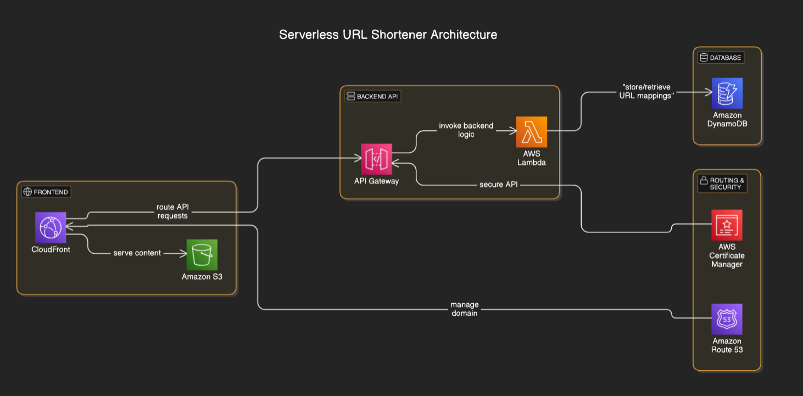

Serverless URL Shortener Using AWS

This project is a fully serverless URL shortener built entirely using the AWS Management Console without any external tools. It allows users to shorten long URLs and access them via custom short links.

#Architecture:

Frontend:            Hosted on Amazon S3 and served via Amazon CloudFront.
Backend API:         Managed by AWS Lambda and exposed through Amazon API Gateway.
Database:            URL mappings are stored in Amazon DynamoDB.
Routing & Security:  Amazon Route 53 for domain management and AWS Certificate Manager for HTTPS.

# Features:

✔ Fully serverless and cost-efficient
✔ Custom short URLs stored in DynamoDB
✔ Secure HTTPS support with CloudFront
✔ API Gateway handles request routing
✔ S3-hosted frontend for easy user interaction

# Technologies Used

AWS Lambda (Python)
Amazon API Gateway
Amazon DynamoDB
Amazon S3 & CloudFront
Amazon Route 53 & AWS Certificate Manager

# Setup & Deployment

Everything in this project is deployed directly via the AWS Management Console, making it ideal for those who want hands-on experience with AWS services.

#DOMAIN
shortmyurl.in

